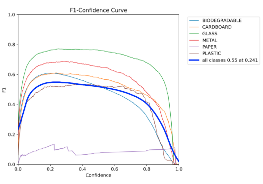
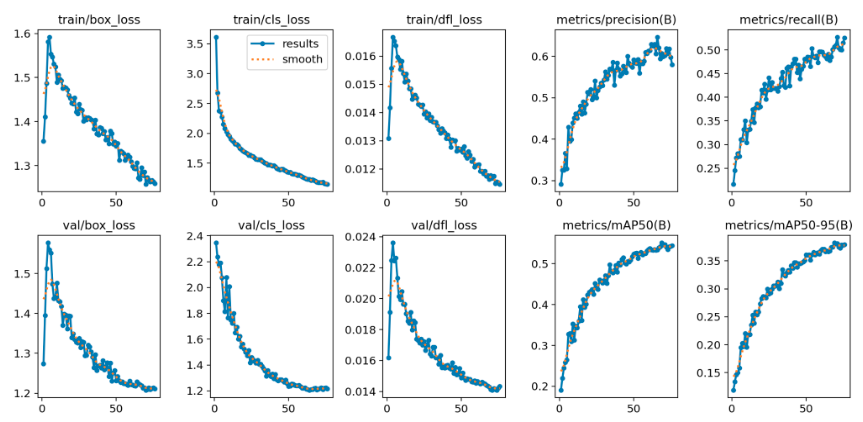
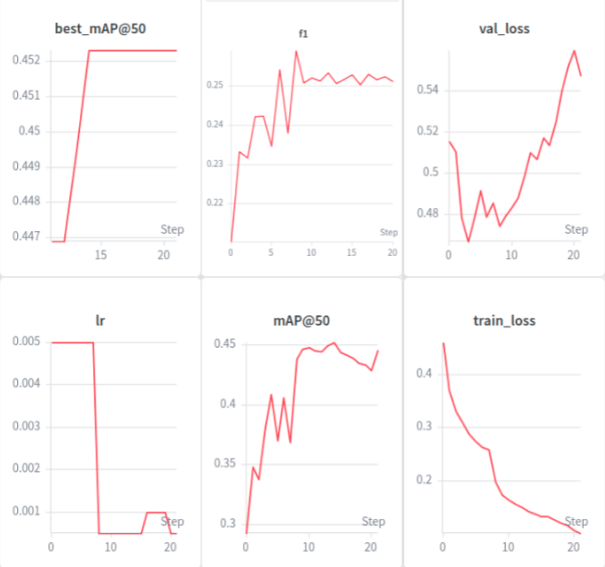
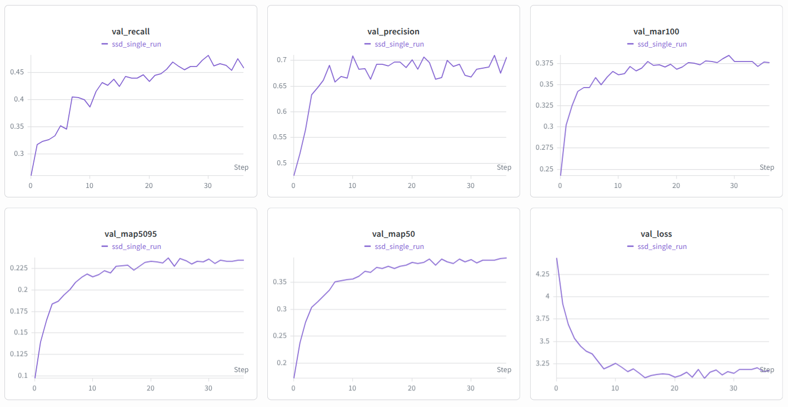
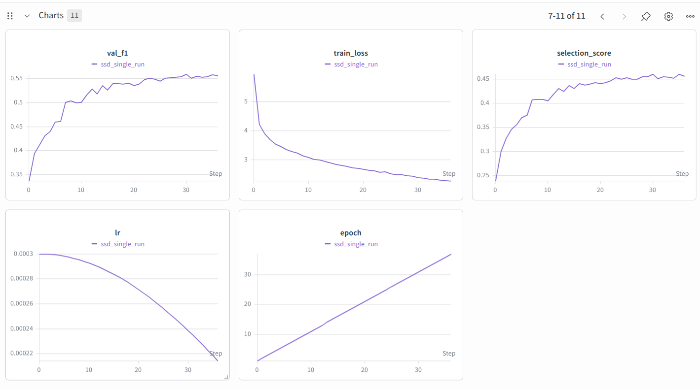

# Model Training Documentation

This document covers the dataset, training methodology, and evaluation results for the three object detection models used in this project. For deployment and architecture details, see the main [README](./README.md).

---

## Contributors

| Model | Trained by |
| :--- | :--- |
| YOLO26 Nano | [@PragsBrags](https://github.com/PragsBrags) |
| Faster R-CNN | [@Aarati-123](https://github.com/Aarati-123) |
| SSD300-VGG16 | [@bugulto](https://github.com/bugulto) |

---

## Dataset

The dataset used is a publicly available garbage detection dataset sourced from Kaggle: [`viswaprakash1990/garbage-detection`](https://www.kaggle.com/), containing annotated images for object detection across six waste categories:

- Biodegradable
- Cardboard
- Glass
- Metal
- Paper
- Plastic

### Dataset Composition

The full dataset comprises 10,464 labeled images, split 70/20/10:

| Split | Directory | Images |
| :--- | :--- | ---: |
| Training | `train/` | 7,324 |
| Validation | `valid/` | 2,098 |
| Test | `test/` | 1,042 |

Each split is organized into two subdirectories: `images/` (JPEG files) and `labels/` (per-image annotation files).

### Annotation Format

Annotations are originally provided in **YOLO format** (normalized center-x, center-y, width, height), making the dataset directly compatible with YOLOv5, YOLOv7, YOLOv8, and other YOLO-family architectures out-of-the-box.

For region-based and anchor-based detectors (Faster R-CNN, SSD), annotations were additionally converted to **Pascal VOC format** (absolute `xyxy` coordinates).

---

## Model Training

Three architecturally distinct object detection models were trained and compared.

### YOLO26 Nano

| Parameter | Value |
| :--- | :--- |
| Base model | YOLO26 Nano |
| Training method | Fine-tuned on the garbage classification dataset |
| Hardware | NVIDIA RTX 3070 (8GB), trained locally |
| Epochs | 74 |
| Batch size | 12 |
| Patience | 7 |
| Evaluation metrics | mAP@50, F1 score, training loss, validation loss |
| Trained by | [@PragsBrags](https://github.com/PragsBrags) |

### Faster R-CNN

| Parameter | Value |
| :--- | :--- |
| Backbone | ResNet-50 FPN, pretrained on COCO |
| Training method | Fine-tuned via transfer learning |
| Platform | Kaggle |
| Epochs | 22 (Epoch 0–21) |
| Evaluation metrics | mAP@50, F1 score, training loss, validation loss |
| Monitoring | Weights & Biases (7 tracked graphs: losses, mAP, F1, learning rate, epoch-wise trends) |
| Trained by | [@Aarati-123](https://github.com/Aarati-123) |

### SSD300-VGG16

| Parameter | Value |
| :--- | :--- |
| Backbone | VGG16, pretrained |
| Training method | Fine-tuned via transfer learning |
| Input size | 300x300 |
| Batch size | 16 |
| Learning rate | 0.0003 |
| Planned epochs | 100 (halted early at epoch 31 as performance plateaued; best checkpoint retained) |
| Epochs evaluated | 37 |
| Best checkpoint epoch | 31 |
| Best validation threshold | 0.3 |
| Evaluation metrics | mAP@50, F1 score, training loss, validation loss |
| Monitoring | Weights & Biases (loss, mAP, F1, learning rate, epoch-wise trends) |
| Trained by | [@bugulto](https://github.com/bugulto) |

**Final SSD validation results:**

| Metric | Value |
| :--- | ---: |
| mAP@0.5 | 0.3926 |
| mAP@0.5:0.95 | 0.2362 |
| mAP@0.95 | 0.0202 |
| mAR@100 | 0.3774 |
| Precision | 0.6685 |
| Recall | 0.4820 |
| F1 | 0.5602 |
| FPS | 36.88 |

**Final SSD test results:**

| Metric | Value |
| :--- | ---: |
| mAP@0.5 | 0.3677 |
| mAP@0.5:0.95 | 0.2403 |
| mAP@0.95 | 0.0178 |
| mAR@100 | 0.4416 |
| Precision | 0.5806 |
| Recall | 0.4801 |
| F1 | 0.5256 |
| FPS | 42.54 |

---

## Model Performance Comparison

### Validation Set Results

| Model | mAP@50 | F1 Score |
| :--- | ---: | ---: |
| Faster R-CNN | 0.4523 | 0.2518 |
| YOLO26 Nano | 0.4600 | 0.4900 |
| SSD300-VGG16 | 0.3926 | 0.5602 |

### Test Set Results

| Model | mAP@50 | F1 Score |
| :--- | ---: | ---: |
| Faster R-CNN | 0.3826 | 0.5838 |
| YOLO26 Nano | 0.4600 | 0.4900 |
| SSD300-VGG16 | 0.3677 | 0.5256 |

**Summary:**

- **YOLO26 Nano** achieved the highest mAP@50 on both validation (0.4600) and test (0.4600) sets, indicating the most consistent and accurate detection performance across all evaluation stages, with no degradation from validation to test.
- **Faster R-CNN** showed a notable mAP@50 drop from validation (0.4523) to test (0.3826), though its F1 score improved significantly (0.2518 to 0.5838), suggesting better class balance on unseen data despite weaker localization consistency.
- **SSD300-VGG16** recorded the lowest mAP@50 on both sets (0.3926 validation, 0.3677 test), with a moderate F1 decline (0.5602 to 0.5256), reflecting consistent but imprecise detection behavior.

---

## Detailed Results

### YOLO26 Nano

The YOLO26 Nano model achieved a mAP@50 of approximately 0.46 on the validation set, with an F1 score of 0.55 at a confidence threshold of 0.241. Training losses converged stably: `box_loss` ≈ 1.25, `cls_loss` ≈ 1.20, `dfl_loss` ≈ 0.012. On the held-out test set, it achieved a mAP@50 of 0.4600 and an F1 score of 0.4900, demonstrating consistent generalization across both evaluation stages.

  
  

### Faster R-CNN

Faster R-CNN achieved a mAP@50 of 0.4523 on the validation set, with a training loss of 0.1380 and a validation loss of 0.5068, and an F1 score of 0.2518 — indicating weaker class-level balance despite reasonable detection accuracy. On the test set, mAP@50 dropped to 0.3826, though the F1 score improved notably to 0.5838, suggesting better class balance on unseen data despite a decline in localization precision.

  

### SSD300-VGG16

SSD300-VGG16 achieved a mAP@50 of 0.3926 on the validation set, with a training loss of 2.3964, a validation loss of 3.1449, and an F1 score of 0.5602 — reflecting reasonable class balance despite the lowest detection accuracy among the three models. On the test set, it achieved a mAP@50 of 0.3677 and an F1 score of 0.5256, showing a moderate and consistent decline across both metrics, indicating stable but imprecise generalization to unseen data.

  
  

---

## Qualitative Analysis

A qualitative comparison on a held-out test image (four metal canisters) reinforced the quantitative metrics observed during training:

- **YOLO26 Nano** produced the most accurate result, detecting exactly four METAL instances with confidence scores between 83.6% and 90.1%, matching the actual object count precisely. This is consistent with its highest mAP@50 (0.460) and confirms its suitability for real-time deployment due to its efficient single-stage architecture.

- **Faster R-CNN**, despite achieving a comparable mAP@50 (0.4523), misclassified all four metal canisters as CARDBOARD and PLASTIC at high confidence. The rectangular geometry of the canisters likely confused the region proposal stage, and the overconfident incorrect predictions align with its low F1 score (0.2518), indicating poor class-level balance in practice.

- **SSD300-VGG16** correctly identified all detections as METAL but generated five bounding boxes for four objects, with two confidence scores dropping sharply to 33.6% and 32.2%. This reflects a fixed-anchor limitation where non-maximum suppression (NMS) failed to suppress all duplicate predictions — consistent with its lowest mAP@50 (0.3926). Its highest F1 score (0.5602) suggests reasonable class balance, but at the cost of detection precision.

---

## Conclusion

**YOLO26 Nano offers the best trade-off between accuracy and reliability** — highest and most consistent mAP@50 across validation and test sets, accurate object counts in qualitative testing, and an efficient single-stage architecture suitable for real-time deployment. This is the model used by default in the deployed application.

**Faster R-CNN** is prone to overconfident misclassification under geometric ambiguity, despite a competitive mAP@50 on paper — its low F1 score reveals this weakness in practice.

**SSD300-VGG16** provides balanced but imprecise detection, with reasonable class identification undermined by duplicate bounding box predictions from incomplete NMS suppression.

All three models remain available in the deployed application for direct comparison.